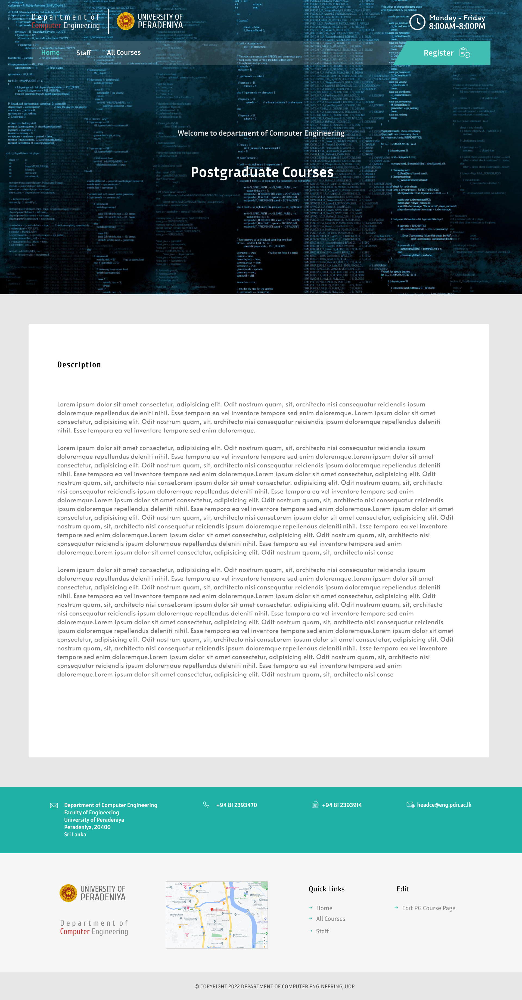
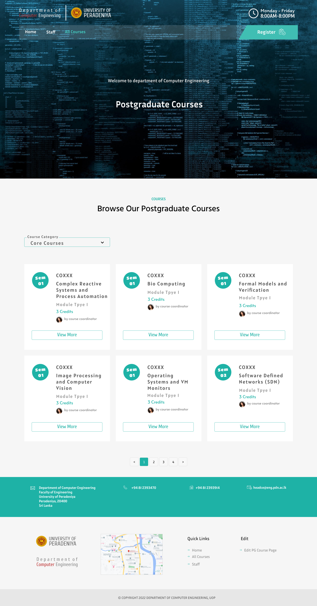
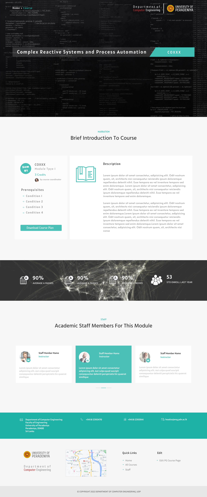
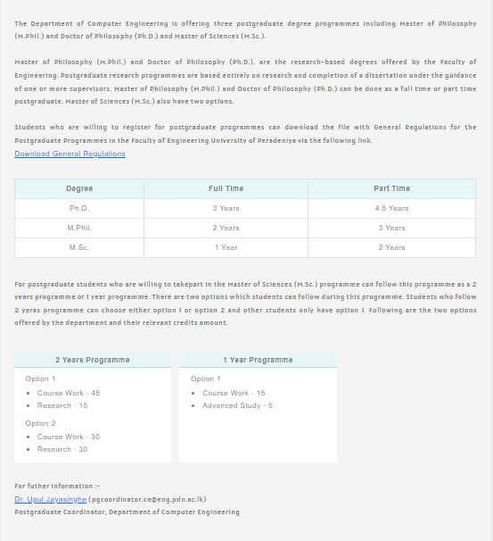
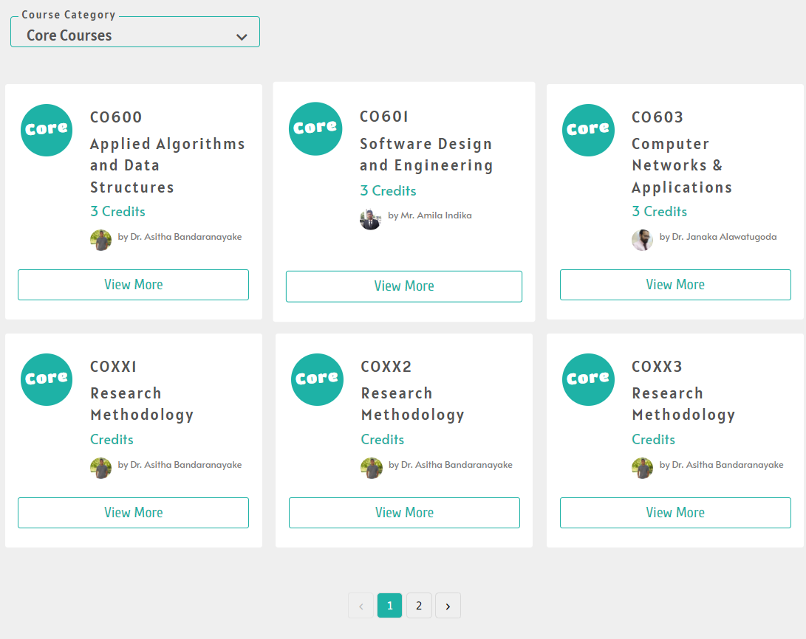
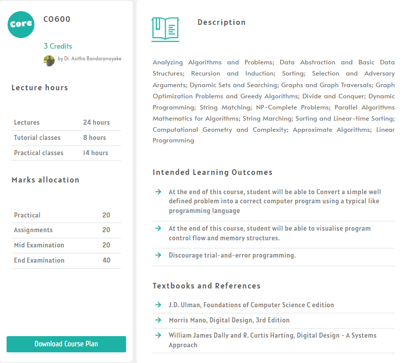

# Department Postgraduate Course Page
---

## Table of Contents
---
1. [Overview](#overview)
2. [Problem](#problem)
3. [Proposed Solution](#proposed-solution)
4. [UI Design](#ui-design)
5. [Technology Infrastructure](#technology-infrastructure)
6. [Data Flow](#data-flow) 
7. [Features and Functionalities](#features-functionalities)
8. [Release Plan](#plan)
9. [Project Team](#project-team)
10. [Links](#links)

## Overview
---

This project contains a web site which will give information about the postgraduate courses offered by the Computer Engineering Department University of Peradeniya. After graduating most of the students are seeking opportunities for higher studies. 

The Computer Engineering Department of the University of Peradeniya also offers many postgraduate courses for those students. Currently, the available web page is lack of details about the courses and content coverage. So, the main intention of this project is to design a very detailed course page for postgraduates. Existing web site only contains about the PhD and MPhil research based programmes.  

## Problem
---

The available course page contains only the research-based postgraduate courses. Although the department does not offer any teaching postgraduate courses, the department is planning to offer around 25 teaching postgraduate courses including technical electives in near future. So, the department is in a need of a new postgraduate course page. 

## Proposed Solution
---

- Develop a very informative web site to keep course information
- Separate web pages for each course
- Detailed course page with statistical data(total registered students, grading average in previous years etc)

## UI Design
---

Following figures are the figma designs for the proposed solution.

<table align="center">
  <tr>
    <td align="center">Home Page</td>
     <td align="center">All-Courses Page</td>
     <td align="center">Single-Course Page</td>
  </tr>
  <tr>
    <td align="center"></td>
    <td align="center"></td>
    <td align="center"></td>
  </tr>
 </table>
 

## Technology Infrastructure
---

These technologies were used to design the layouts.

  - HTML/CSS/Java Script - Used to develop and style the frontend
  - Jekyll               - Used as a static site generator
  - Json                 - Used to store the data
  - GitHub Pages         - Used to host the Web Page

  

## Data Flow
---

## Features and Functionalities
---

#### Navigation bar

Navigation bar has three tabs which are Home, All Courses and Staff.

  - Home - this will redirect to the home page
  - All Courses
      - Ph.D. - this will redirect to the existing postgradutae page
      - M.Phill. - this will redirect to the existing postgradutae page
      - M.Sc Eng/M.Sc. -  this will redirect to the all courses page
  - Staff - this links to the academic staff section in the people site

#### Footer section

  - Contact - contact information of the Computer Engineering Department University of Peradeniya 
  - Courses - links to Ph.D. M.Phill and M.Sc.Eng / M.Sc.
  - Quick Links
      - Home
      - Staff
      - Edit this page
      - Documentation
  
  
#### Home page

This page consits a description to postgraduate courses in Computer Engineering Department and also the durations of the courses. Also, options availbale for the postgraduates who are willing to follow those programmes.

#### All courses page

This has a dropdown menue to choose the course type. Available course types are
  - Core Courses
  - Technical Electives
  - Research Topics
 
User can also choose the "All" option which will display all the courses under above course categories.
Each couse card contains
  - Course category
  - Course code and course name
  - Number of credits
  - Course coordinator
  - View More option - this will redirect to the relevant single course page

#### Single course page

This page describes the relevant course with more details. Main features of the course page are,

  - Course Description
  - Course Plan (Lecture/Lab/Tutorial hours and breakdown)
  - Course Modules
  - ILOs
  - Credits
  - Lecturers with details (may be changed from time to time)
  - Reference Books
  - Grade distribution

## Release Plan
---

## Project Team
---

#### Product Owner
---
-  Mr. Nuwan Jaliyagoda - [nuwanjaliyagoda@eng.pdn.ac.lk](nuwanjaliyagoda@eng.pdn.ac.lk)
  
#### Scrum Master
---
-  Mr. Imesh Ekanayake - [imeshuk@eng.pdn.ac.lk](imeshuk@eng.pdn.ac.lk)

#### Project Developers
---
-  E/18/010, Avishka Abeywickrama - [e18010@eng.pdn.ac.lk](e18010@eng.pdn.ac.lk)
-  E/18/203, Shehan Madhusanka - [e18203@eng.pdn.ac.lk](e18203@eng.pdn.ac.lk)
-  E/18/264, Madushan Prasanna - [e18264@eng.pdn.ac.lk](e18264@eng.pdn.ac.lk)

## Links
---

- [Project Repository](https://github.com/cepdnaclk/e18-co227-Department-Course-Page-Group-B)
- [Project Page](https://cepdnaclk.github.io/e18-co227-Department-Course-Page-Group-B/)
- [Department of Computer Engineering](http://www.ce.pdn.ac.lk/)
- [University of Peradeniya](https://eng.pdn.ac.lk/)

[//]: # (Please refer this to learn more about Markdown syntax)
[//]: # (https://github.com/adam-p/markdown-here/wiki/Markdown-Cheatsheet)
<!---->
